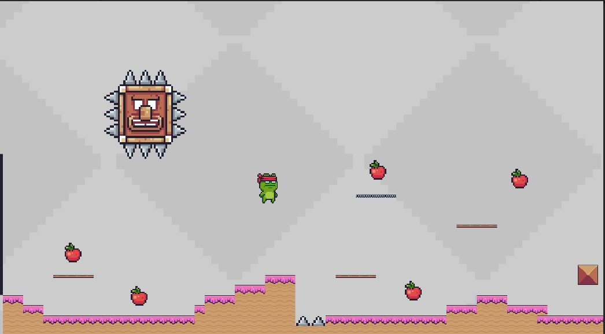
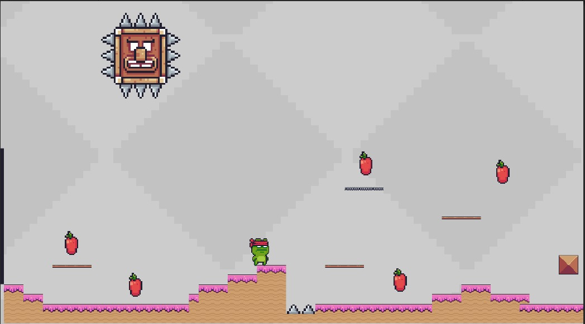
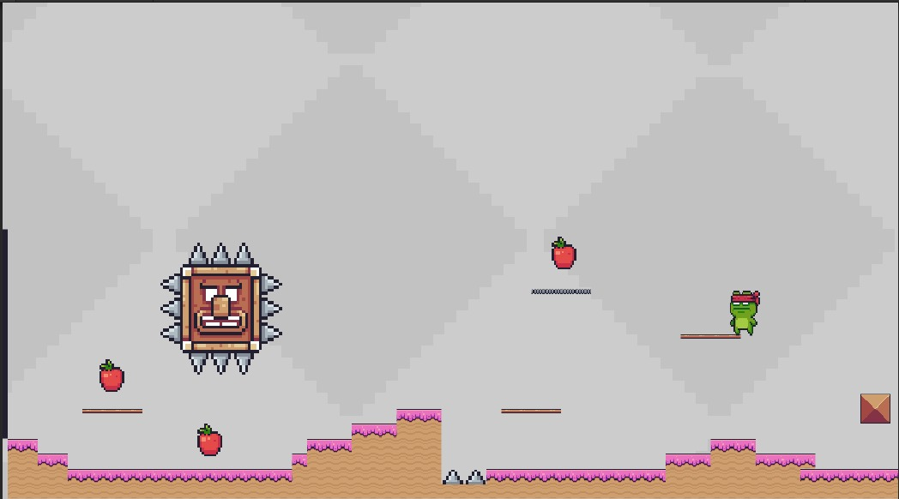

# Integrantes:
- Anthony Cano Sucso    
- Jose Luis Jarro C.

# Proyecto: Froggy's Fruit Adventure

## Descripción del Videojuego
Froggy's Fruit Adventure es un juego en el que controlas a una simpática rana que debe recolectar frutas para completar su misión. Sin embargo, ten cuidado con las cabezas de pino con pinchos, ya que al tocarlas reiniciarán el juego. ¿Podrás ayudar a Froggy a recoger todas las frutas y superar los desafíos?

## Imágenes (Se muestran imagenes del juego)

## Características Principales
- Controla a Froggy a través de diferentes niveles llenos de frutas y obstáculos.
- Recolecta todas las frutas para completar la misión y avanzar al siguiente nivel.
- Evita las cabezas de pino con pinchos, ya que reiniciarán el juego si las tocas.
- ¡Disfruta de la simplicidad y diversión de este adictivo juego!

## Instalación
 -UNITY
## Licencia
 Este proyecto es una demo en 2D

## Contacto
Si tienes alguna pregunta o sugerencia, no dudes en ponerte en contacto con nosotros en [skhjsfsdhjsdh@gmail.com].

¡Gracias por tu interés en Froggy's Fruit Adventure!
